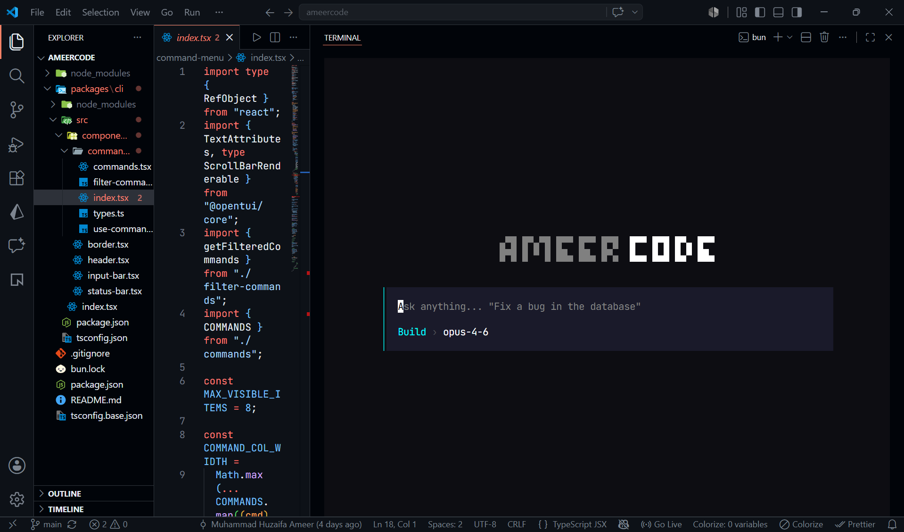
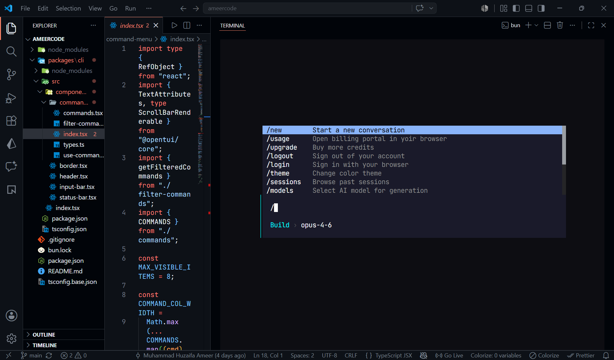

<div align="center">

# ⚡ Ameer Code

### AI Coding Agent for the Terminal

Build, debug, explain, and ship code faster with multiple state-of-the-art AI models—all from your terminal.

<p>
  
  
  
  
  
  
</p>

*A modern AI coding assistant designed for developers who live in the terminal.*



</div>

---

## ✨ Features

- 🤖 Multi-LLM support
- 💬 Beautiful interactive CLI
- 📂 Project-aware conversations
- 🧠 Long conversation memory
- 📄 File creation & editing
- 🛠️ Code generation
- 🐛 Bug fixing & debugging
- ♻️ Code refactoring
- 📖 Code explanation
- 🚀 Command generation
- 🔍 Terminal command assistance
- 🔐 Secure authentication with Clerk
- 👤 User accounts
- 🔄 Persistent sessions
- 💾 Chat history
- 🌙 Modern terminal interface
- ⚡ Fast runtime powered by Bun
- 🛡️ Secure API key management

---

# 🧠 Supported AI Models

Use your favorite AI model without leaving the terminal.

### Anthropic

- Claude Opus
- Claude Sonnet
- Claude Haiku

### OpenAI

- GPT-5
- GPT-4.1
- GPT-4o

### Google

- Gemini 2.5 Pro
- Gemini 2.5 Flash

### xAI

- Grok

### Moonshot AI

- Kimi

More providers coming soon.

---

# 📸 Preview

```bash
$ bun run dev:cli

⚡ Ameer Code

────────────────────────────────────────────

✔ Signed in
✔ Connected

Model: Claude Opus

>

Create a production-ready authentication system using Clerk and Hono.

Thinking...

✔ Generated project successfully.
```

Type `/` at any time to open the command menu:



---

# 🚀 Getting Started

## Clone the repository

```bash
git clone https://github.com/yourusername/ameer-code.git

cd ameer-code
```

## Install dependencies

```bash
bun install
```

## Configure environment variables

Create a `.env` file.

```env
# Clerk
CLERK_SECRET_KEY=
CLERK_PUBLISHABLE_KEY=

# Database
DATABASE_URL=

# AI Providers
OPENAI_API_KEY=
ANTHROPIC_API_KEY=
GEMINI_API_KEY=
XAI_API_KEY=
KIMI_API_KEY=
```

## Start the CLI

```bash
bun run dev:cli
```

---

# 🔐 Authentication

Ameer Code uses **Clerk** for secure authentication.

Features include:

- Email & Password Sign In
- User Registration
- Secure Session Management
- Persistent Login
- Sign Out
- Protected Routes
- OAuth Support (optional)
- Server-side Authentication

---

# 💻 Available Commands

Start CLI

```bash
bun run dev:cli
```

Run development server

```bash
bun run dev
```

Build project

```bash
bun run build
```

Start production

```bash
bun start
```

---

# 📁 Project Structure

```
ameer-code
│
├── apps
│   ├── cli
│   └── server
│
├── packages
│   ├── sdk
│   ├── ui
│   └── shared
│
├── prisma
│
├── docs
│
├── .env
│
└── README.md
```

---

# 🚀 What Can Ameer Code Do?

- Generate complete applications
- Build REST APIs
- Generate React & Next.js components
- Write TypeScript code
- Fix runtime errors
- Explain unfamiliar code
- Refactor existing projects
- Generate SQL queries
- Write Dockerfiles
- Help with Git commands
- Create configuration files
- Explain terminal commands
- Answer programming questions
- Assist with backend development
- Help with frontend development
- Improve code quality

---

# 🔒 Security

Security is built into every layer.

- Clerk Authentication
- Secure Session Management
- Protected API Routes
- Environment Variable Protection
- Input Validation
- Secure Database Access
- API Key Isolation

---

# ⚙️ Tech Stack

### Runtime

- Bun

### Language

- TypeScript

### Backend

- Hono

### Database

- PostgreSQL
- Prisma ORM

### Authentication

- Clerk

### Validation

- Zod

### CLI

- React Ink

---

# 🛣️ Roadmap

## Completed

- ✅ Multi-LLM Support
- ✅ Clerk Authentication
- ✅ User Accounts
- ✅ Secure Sessions
- ✅ Interactive CLI
- ✅ Project Context
- ✅ Chat History

## Coming Soon

- MCP Support
- Plugin System
- Local Models (Ollama)
- AI Agents
- Voice Commands
- Cloud Sync
- Custom Themes
- File Diff Viewer
- Team Workspaces

---

# 🤝 Contributing

Contributions are always welcome.

1. Fork the repository

2. Create a new branch

```bash
git checkout -b feature/amazing-feature
```

3. Commit your changes

```bash
git commit -m "Add amazing feature"
```

4. Push to GitHub

```bash
git push origin feature/amazing-feature
```

5. Open a Pull Request

---

# ⭐ Support the Project

If Ameer Code helps you, please consider giving the repository a ⭐ on GitHub.

It helps more developers discover the project and supports future development.

---

# 📄 License

This project is licensed under the **MIT License**.

---

<div align="center">

## ⚡ Built with ❤️ by Ameer

**The AI coding agent built for developers who prefer the terminal.**

If you like the project, don't forget to ⭐ the repository!

</div>